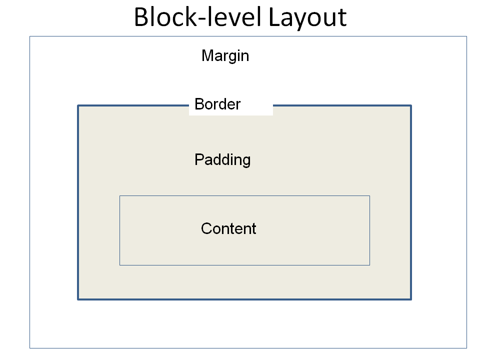
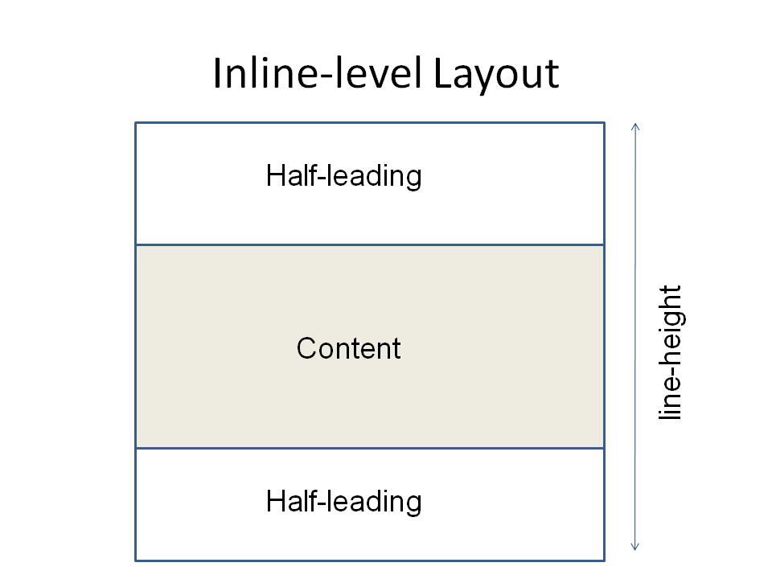
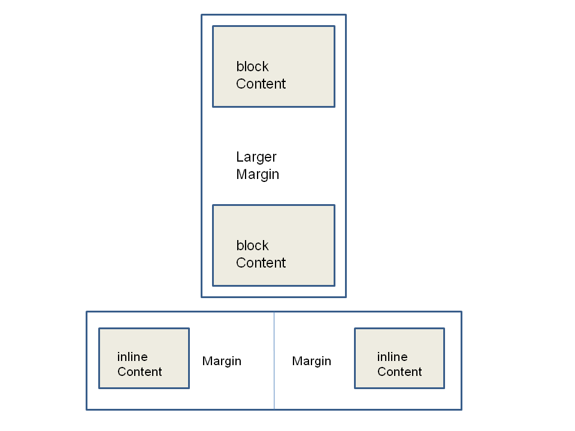

hello again :)

[CSS SPECS](https://www.w3.org/Style/CSS/#specs)

CSS Overview
===

Cascading Style Sheets (CSS) are used to give a page better look and feel. They can be swapped to apply different themes/skins to the page. The process can be summarized by the following steps:

1. Select elements to style
2. Specify properties to style
3. Choose a value for each property being styled

Where styles are specified
---

There are 3 ways to specify CSS:

1. Inline style using `style` attribute on tags to associate style with an element
2. Embedded into the header of the HTML file (ie. `head`)
3. External style sheets in a separate .css file

Inline Styles
---
Use the `style` tag. There are no selectors because the style element is applied directly to the element.

    <element style="property1: value1; property2: value2; ... propertyN; valueN;">...
    </element>
Eg.

    

    Watch out!
    

Embedded Styles
---
Embedded styles are CSS snippets embedded directly into the markup page, for HTML this goes in the `head` as a `style` tag.

    <head>
        <meta http-equiv="Content-Type" content="text/html; charset=UTF-8" />
        <title>Styling Document</title>
        <!-- embedded style sheet, only applies to elements in this document -->
        
    </head>
    <body>
        <h1>Purple heading</h1>
        

            white text with blue background
        

    </body>

External Styles
---

External Styles are saved in a separate file that has a .css extension. The files are included using `link` in `head`. External style sheets are preferred because:
* They allow multiple pages to share styles with one source
* Styles can be changed independent of the markup file
* The separate files are cached by the browser, which reduces consecutive load times
* Styles can still be overridden within the markup if needed
* (Keep in mind this document has mostly embedded styles, for ease of reading)

In `link`, there is a `media` attribute used to describe when this style sheet should be included. Various options are:

| Value         | Desc      |
|-|-|
| `screen`      | Computer screens (this is default)                            |
| `tty`         | Teletypes and similar media using fixed-pitch character grid  |
| `tv`          | Television devices (low res, limited scrolling)               |
| `projection`  | Projectors                                                    |
| `handheld`    | Handheld devices                                              |
| `print`       | Print preview mode/ printed pages                             |
| `braille`     | Braille feedback devices                                      |
| `aural`       | Speech synthesizers                                           |
| `all`         | Suitable for all devices                                      |

With `style1.css` hosted at `https://training.com` :

HTML:

    <head>
        <meta http-equiv="Content-Type" content="text/html; charset=UTF-8" />
        <title>Styling Document</title>
        <link rel="stylesheet" type="text/css" 
            href="https://training.com/styles/style1.css" media="all" />
    </head>
    <body>
        <h1>Purple heading</h1>
        

            white text with blue background
        

    </body>

https://training.com/styles/style1.css

    h1
    {
        color: purple;
    }
    p
    {
        color: white;
        background-color: blue;
    }

Creating Style Sheets
===

A CSS file consists of one or more rules and optional comment blocks. Comments appear between `/* and */`, like in C#.

A rule consists of one or more selectors separated by commas, followed by a declaration block containing properties and values. The syntax of a rule is:

    selector1, selector2, ...
    {
        property1: value1;
        property2: value2;
    }

The listed properties are applied to any selected element.

Selectors
===
Used to indicate which elements this style applies to.

Element Selectors
---

| Selector | Meaning |
|-|-|
|`*`                    | All Elements selected (default values of the style) |
|`Element1`             | Name of element, such as `h1` or `p`|
|`#idname`              | The element that has `id="idname"`|
|`.classname`           | All elements with `class="classname"`|
|`Element1.classname`   | The element of type `element1` with a class that includes `classname` |
|`Element1#idname`      | The element of type `element1` with id `idname`. Not generally needed |

Combinators
---

For the following selectors, `Selector#` may be an element, class, or id

| Selector | Meaning |
|-|-|
| `Selector1 Selector2` | Selector2, if it is a descendant of Selector1 |
| `Selector1 > Selector2` | Selector2, if it is a child of Selector1 |
| `Selector1 + Selector2` | Selector2, only if it immediately follows Selector1, and both are children of the same parent |
| `Selector1 ~ Selector2` | Selector2, if it is a later sibling of Selector1 |

Attribute Selectors
---

Attribute selectors select elements with any or a specific value for certain attributes:

| Selector | Meaning |
|-|-|
| `[attribute]` | Selects all elements where the specified attribute has been set to any value. |
| `[attribute=value]` | Selects all elements where the specified attribute has been set to exactly `value`. |
| `[attribute~=value]` | Selects all elements where the specified attribute value is a whitespace-separated list of words, one of which is exactly `value`. |
| `[attribute^=value]` | Selects all elements where the specified attribute value begins with `value`. |
| `[attribute$=value]` | Selects all elements where the specified attribute value ends with `value`. |
| `[attribute*=value]` | Selects all elements where the specified attribute contains `value`. |

This can be used with any element, but it is particularly useful for form input elements, since they are distinguished by the `type` attribute. For example, you can set a uniform width to all `input` elements of type `text`:

    input[type=text]
    {
        width: 500px;
    }

Properties
===
Properties define possible legal values, initial value, what elements it applies to and if the property is inherited.

Types of Values
---
* Keywords - defined on a per-property basis
* Color - 17 predefined names, hexadecimal `#RRGGBB`, or `rgb(#,#,#)`
* URL - `url(address)`
* Numbers - any valid number. Typically property restricted, and sometimes qualified with `px`, `%`, or `em`
    * `px` = number of pixels, eg. `10px`
    * `%` = percentage, computed relative to something else, eg. `120%`
    * `em` = size relative to font size

Colors
---
* Careful of hard-coding colors, because they won't change with customization.
* `#RRGGBB` = The hexadecmial equivalent to amount of red, green, blue from 00-FF (0-255 in decimal)  
0123456789ABCDEF
* Picking a Color:
    * Follow color standards for your application
    * [Follow web standards](https://en.wikipedia.org/wiki/Web_colors)
    * Use color schemes from other sources (eg. [Adobe](http://kuler.adobe.com/))
    * Pick colors from a web page. Eg. Internet Explorer > Dev Tools F12 > Tools > Show Color Picker
    * Use Web or Windows (eg. Paint) tools to find colors in decimal. If you get a number in decimal it can be converted to hexadecimal.

Style Precedence
===

Resolving Conflicting Styles
---
Multiple style sheets and specifications may be linked in to document. Conflicts are resolved using the cascade, via *specificity* and *inheritance*.

Calculating Specificity
---
Describes the weight of a selector and associated styles. Takes four numbers in the following order:
1. Is it a style attribute? One point, no other points assigned.
2. Does the selector have ids? One point each.
3. Does the selector have any classes, pseudo-classes or attribute selectors? One point each.
4. Does the selector have any element names? One point each.

Each piece of the score is evaluated in order with the style selector having the highest precedence and the element names the lowest.

Here's a list of scores from least to most specific:
| Selector | Specificity |
|-|-|
|`Element1` | 0,0,0,1 |
|`Element1 Element2` | 0,0,0,2 |
| `.classname` | 0,0,1,0 |
| `Element:hover` | 0,0,1,1 |
| `Element1.classname` | 0,0,1,1 |
| `Element:hover[title=example]` | 0,0,2,1 |
| `element1#idname` | 0,1,0,1 |
| `style="..."` | 1,0,0,0 |

Inheritance
---
Elements in a document form a tree: `html` is the root. Style applied to an element is inherited by descendants unless the property is not inherited.

Cascade
---
Cascade is used to resolve conflicts in styles. Ignores author vs. reader vs. browser rules.

### The Cascade Algorithm
1. Gather all style sheets together, combine styles from all linked style sheets, embedded styles, and inline styles
2. For each property, find all declarations that match
    * Do any selectors select element? If yes, stop looking for declarations
    * If no selectors, use inheritance to find declarations
    * If not inherited, use browser default
3. Sort the declarations by how specific they are using specificity numbers
    * Rules marked with !important are more specific
4. Sort any conflicting rules in the order they appear in their individual style sheets. Rules listed later are more important.

Examples:  
[style2.css](style2.css)  
[cascade.html](cascade.html)

Tools
---

The following IE and Chrome Developer Toolbars are particularly useful debugging CSS problems resulting from conflicting styles.
1. Open developer tools using the __F12__ key.
2. Select the DOM Elements (IE) or Elements (Chrome) tab
3. Navigate to the element you're interested in, or right-click on the page and choose "Inspect"
4. Inspect or modify the styles from the __Styles__ sub-tab.
5. Determine which styles were overridden using the __Computed__ sub-tab.

Font Properties
===

font-family
---

* Either a specific font or family of fonts may be specified.
* There are 5 families: sans-serif, serif, monospace, cursive, fantasy.
* The font must exist on the machine to be used.
* May specify multiple fonts in the order to be tried
* Use quotes around font names that contain spaces

Eg.

    body
    {
        font-family: Verdana, Arial, sans-serif;
    }
    .code
    {
        font-family: "Courier New", monospace;
    }

font-size
---

* Value is keyword, percentage or absolute pixels
* Keywords: xx-small, x-small, xmall, medium, large, x-large, xx-large
* Recommended: choose a keyword for the body and use percentages to make other texts relative to that size
    * Allows users to resize text

Eg.

    body
    {
        font-size: small;
    }
    h1
    {
        font-size: 150%;
    }
    h2
    {
        font-size: 120%;
    }

color
---
Sets the foreground color of an element: also applies to border or element

    h2
    {
        color: navy;
    }

font-weight
---
Determines the boldness of the text: keywords are normal, bold, bolder, lighter

    .enterdata
    {
        font-weight: bold;
    }

font-style
---
Determines the style of the text: keywords are italic, oblique, normal. Users may not be able to tell the difference between italic and oblique

    .prompt
    {
        font-style: italic;
    }

text-decoration
---
Determines the decoration of the text. Keywords are underline, overline, line-through

    .under
    {
        text-decoration: underline;
    }

text-align
---
Sets horizontal alignment of text within a block-level element. Keywords are left, center, right

    .right
    {
        text-align: right;
    }

text-indent
---
Sets indentation of the first line of content in a block-level element. Value is percentage or absolute pixels

    .indent
    {
        text-indent: 20px;
    }

white-space
---
Declares how white space within an element is handled during layout:
* normal reduces any sequence of whitespace to a single space
* nowrap prevents an element from line-breaking

Eg.

    .normal
    {
        white-space: normal;
    }

Examples:  
[style3.css](style3.css)  
[fonts.html](fonts.html)

Box Model
===

Block-level elements
---
* Generate an element box that fills parent element's content area
* No elements to sides
* Line breaks before and after the element box

Inline-level element
---
* Generate an element box within a line of text
* Doesn't break the flow of the line

Block-level Layout
---

* Background extends to outer edge of border, filling content, padding, border areas
* Margins are transparent
* Only margins, height, width properties can be auto
* Only margins can be negative
* Padding defaults to zero
* Border defaults to none
* Total width: left margin + left border width + left padding + width + right padding + right border width + right margin
* Total height: top margin + top border width + top padding + height + bottom padding + bottom border width + bottom margin

Inline-level Layout
---

* line height: leading + content
* Leading is the difference between line-height and font-size
* Line box extends from highest inline box to lowest inline box for a line

Margins
---

* With adjacent inline elements, the margins are added.
* With stacked block elements, margin is collapsed to larger margin.

line-height
---
* Used in determining the layout of inline boxes
* Value is number or percentage of font-size

Examples:  
[style4.css](style4.css)  
[lineheight.html](lineheight.html)

Background
===

For Background, no properties are inherited.

background-color
---
Value is a color or keyword transparent: color fills the content, padding, and border area of an element.

    p
    {
        background-color: white;
    }

background-image
---
Place an image in the background of element. Value is a URL or keyword `none`. Don't put images that provide meaning in the background because there is no alt text.

    body
    {
        background-image: url(./images/cathole.jpg);
    }

background-repeat
---
Define the tiling pattern for the background image: repeat, repeat-x, repeat-y, no-repeat

    body
    {
        background-repeat: repeat;
    }

background-position
---

* How the background image is positioned within the element.
* Value is keyword or exact horizontal and vertical position.
* Keywords: `bottom`, `center`, `left`, `right`, `top`

Eg.

    body
    {
        background-position: 10px 10px;
    }

Example:  
[style5.css](style5.css)  
[background.html](background.html)  

Layout Properties
===
None of these properties are inherited.

width
--
Defines the width of element's content area. Value is a number of pixels, percentage of containing block, or keyword auto. Auto by default

    #id
    {
        width: 100px;
    }

height
---
Defines the height of the element's content area. Value is a number of pixels, percentage of containing block, or keyword auto. Auto by default

    #id
    {
        height: 100px;
    }

Padding
---
May specify different size padding on each side of content
* padding-top
* padding-right
* padding-bottom
* padding-left

Value is a number in pixels or a percentage of containing block

    #id
    {
        padding-top: 20px;
        padding-right: 20px;
        padding-bottom: 20px;
        padding-left: 20px;
    }

Border Width
---
May specify different width on each side of content. Sets the width for border of an element
* border-top-width
* border-right-width
* border-bottom-width
* border-left-width

Takes effect if the border style is not none. Value is number of pixels or keywords: thin, medium, thick

    #id
    {
        border-top-width: thick;
        border-right-width: thick;
        border-bottom-width: thick;
        border-left-width: thick;
    }

Border Style
--
May specify different style on each side of content. Defines the style for border of element
* border-top-style
* border-right-style
* border-bottom-style
* border-left-style

May render slightly different with different browsers. Keywords are `none`, `hidden`, `dotted`, `dashed`, `solid`, `double`

    #id
    {
        border-top-style: solid;
        border-right-style: solid;
        border-bottom-style: solid;
        border-left-style: solid;
    }

Border Color
---
May specify different color on each side of content. Sets color for visible border
* border-top-color
* border-right-color
* border-bottom-color
* border-left-color

May be a color or keyword transparent. Color property of element by default

    #id
    {
        border-top-color: yellow;
        border-right-color: yellow;
        border-bottom-color: yellow;
        border-left-color: yellow;
    }

Margin
---
May specify different size margin on each side of content
* margin-top
* margin-right
* margin-bottom
* margin-left

Value is a number of pixels, percentage of containing block, or keyword `auto`

    #id
    {
        margin-top: 10px;
        margin-right: 10px;
        margin-bottom: 50px;
        margin-left: 10px;
    }

Example:  
[style6.css](style6.css)  
[layout.html](layout.html)  

Shortcuts
===
* Use when specifying more than one related property
* If specifying only one property, spell it out plz
* Properties not specified take on default values or become none

Background Shortcuts
---
Single rule for background properties: give value to `color`, `image`, `repeat`, `position`. Sets value to default if not explicitly declared.

    /* before */
    body
    {
        background-image: url(cathole.JPG);
        background-repeat: repeat;
    }

    /* after */
    body
    {
        background: url(cathole.JPG) repeat;
    }

Padding Shortcuts
---
Single rule for size of padding overall or on each side. Specify:
* single value for all sides
* List in order of top, right, bottom, left (clockwise)
* First value for top and bottom, second value for right and left

Examples (all the same):

    #id
    {
        padding: 20px 20px 20px 20px;
    }

    #id
    {
        padding: 20px 20px;
    }

    #id
    {
        padding: 20px;
    }

Border Shortcuts
---
### Property Based
* `border-color`: Single rule for color of border overall or on each side
* `border-style`: Single rule for style of border overall or on each side
* `border-width`: Single rule for width of border overall or on each side
* Single value for all sides, list order of top, right, bottom, left (clockwise), or first value is top/bottom, second is left/right

Eg.

    #id
    {
        border-color: yellow;
        border-style: solid;
        border-width: thick;
    }

### Location Based
* `border-top`: Sets the width, style, color of top border
* `border-right`: Sets the width, style, color of right border
* `border-bottom`: Sets the width, style, color of bottom border
* `border-left`: Sets the width, style, color of left border

Eg.

    #id
    {
        border-top: yellow solid thick;
    }

### All Borders
`border` alone sets the style, width, and color of overall border. Sets value to default if not explicitly declared.

    #id
    {
        border: yellow solid thick;
    }

Margin Shortcuts
---
Single rule for size of margin overall or on each side. Same clockwise rules: all the below are the same.

    #id
    {
        margin: 20px 20px 20px 20px;
    }

    #id
    {
        margin: 20px 20px;
    }

    #id
    {
        margin: 20px;
    }

Example:  
[style8.css](style8.css)  
[Shortcuts.html](Shortcuts.html)  

Pseudo-classes & Hyperlinks
===

A CSS pseudo-class is a keyword added to selectors that specifies a special state of the element to be selected. For example :hover will apply when the user hovers over the element specified by the selector
* Acts like a class but isn't really
* Browser adds & removes pseudo classes automatically
* May be styled like other classes

__DON'T USE HOVER PSEUDO-SELECTORS WITH SIBLING SELECTORS.__ This causes performance issues with for the entire web page.

Syntax
---

    selector:pseudo-class {...}

Hyperlinks
---

* States: unvisited, visited, hover
* Corresponding pseudo-classes: link, visited, hover
* Pseudo-classes for keyboard access to a hyperlink
    * active (when clicking)
    * focus (when it has focus)
* Note: hover may be applied to elements other than anchor tags
* Hyperlinks can match multiple states (hover & visited) so order of rules matters

Example:  
[style9.css](style9.css)  
[pseudo.html](pseudo.html)  

List Styles
===

* May specify the below elements, or use `list-style` as a shortcut to combine type/image and position
* Applies to elements: ol, ul, li
* All properties are inherited

list-style-type
---

* Used to declare the type of marker system to be used in presentation of list
* Keywords: disc, circle, square, decimal, upper-alpha, lower-alpha, upper-roman, lower-roman, none, ...

Eg.

    ul
    {
        list-style-type: square;
    }

list-style-image
---

Specifies tye image used as marker: value is URL or keyword none

    #special
    {
        list-style-image: url(./images/face.png)
    }

list-style-position
---
Used to declare position of the list marker with respect to the list item. Inside or outside

    ol
    {
        list-style-position: inside;
    }

Examples:  
[style10.css](style10.css)  
[list.html](list.html)  

Table Styles
===